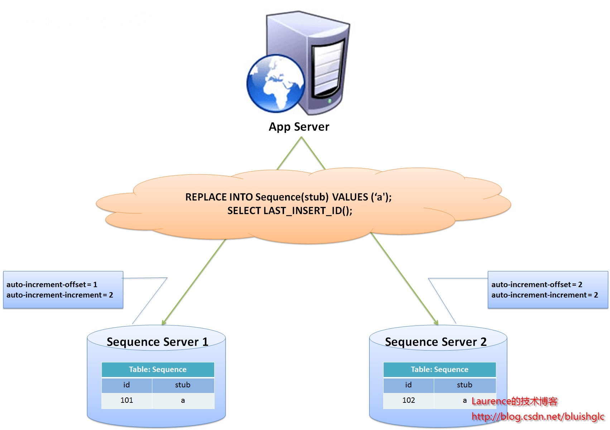

title: "数据库分库分表(sharding)系列(一) 拆分实施策略和示例演示"
date: 2013-06-04 10:03:01
category: database
tags: database
comments: true
---

[本文出处](http://blog.csdn.net/bluishglc/article/details/7710738)

本系列相关文章：

* 数据库Sharding的基本思想和切分策略
* 数据库分库分表(sharding)系列(一) 拆分实施策略和示例演示
* 数据库分库分表(sharding)系列(二) 全局主键生成策略
* 数据库分库分表(sharding)系列(三) 关于使用框架还是自主开发以及sharding实现层面的考量
* 数据库分库分表(sharding)系列(四) 多数据源的事务处理
* 数据库分库分表(sharding)系列(五) 一种支持自由规划无须数据迁移和修改路由代码的Sharding扩容方案

本文将主要介绍一些常见的全局主键生成策略，然后重点介绍flickr使用的一种非常优秀的全局主键生成方案。关于分库分表(sharding)的拆分策略和实施细则，请参考该系列的前一篇文章：
[数据库分库分表(sharding)系列(一) 拆分实施策略和示例演示](http://blog.csdn.net/bluishglc/article/details/7696085)

本文原文连接: http://blog.csdn.net/bluishglc/article/details/7710738 ,转载请注明出处！

## 第一部分：一些常见的主键生成策略

一旦数据库被切分到多个物理结点上，我们将不能再依赖数据库自身的主键生成机制。一方面，某个分区数据库自生成的ID无法保证在全局上是唯一的；另一方面，应用程序在插入数据之前需要先获得ID,以便进行SQL路由。目前几种可行的主键生成策略有：

1. UUID：使用UUID作主键是最简单的方案，但是缺点也是非常明显的。由于UUID非常的长，除占用大量存储空间外，最主要的问题是在索引上，在建立索引和基于索引进行查询时都存在性能问题。

2. 结合数据库维护一个Sequence表：此方案的思路也很简单，在数据库中建立一个Sequence表，表的结构类似于：

	CREATE TABLE `SEQUENCE` (
		`tablename` varchar(30) NOT NULL,
		`nextid` bigint(20) NOT NULL,
		PRIMARY KEY (`tablename`)
	) ENGINE=InnoDB

每当需要为某个表的新纪录生成ID时就从Sequence表中取出对应表的nextid,并将nextid的值加1后更新到数据库中以备下次使用。此方案也较简单，但缺点同样明显：由于所有插入任何都需要访问该表，该表很容易成为系统性能瓶颈，同时它也存在单点问题，一旦该表数据库失效，整个应用程序将无法工作。有人提出使用Master-Slave进行主从同步，但这也只能解决单点问题，并不能解决读写比为1:1的访问压力问题。

除此之外，还有一些方案，像对每个数据库结点分区段划分ID,以及网上的一些ID生成算法，因为缺少可操作性和实践检验，本文并不推荐。实际上，接下来，我们要介绍的是Fickr使用的一种主键生成方案，这个方案是目前我所知道的最优秀的一个方案，并且经受了实践的检验，可以为大多数应用系统所借鉴。

## 第二部分：一种极为优秀的主键生成策略

flickr开发团队在2010年撰文介绍了flickr使用的一种主键生成测策略，同时表示该方案在flickr上的实际运行效果也非常令人满意，原文连接：Ticket Servers: Distributed Unique Primary Keys on the Cheap 这个方案是我目前知道的最好的方案，它与一般Sequence表方案有些类似，但却很好地解决了性能瓶颈和单点问题，是一种非常可靠而高效的全局主键生成方案。

图1. flickr采用的sharding主键生成方案示意图(点击查看大图)

flickr这一方案的整体思想是：建立两台以上的数据库ID生成服务器，每个服务器都有一张记录各表当前ID的Sequence表，但是Sequence中ID增长的步长是服务器的数量，起始值依次错开，这样相当于把ID的生成散列到了每个服务器节点上。例如：如果我们设置两台数据库ID生成服务器，那么就让一台的Sequence表的ID起始值为1,每次增长步长为2,另一台的Sequence表的ID起始值为2,每次增长步长也为2，那么结果就是奇数的ID都将从第一台服务器上生成，偶数的ID都从第二台服务器上生成，这样就将生成ID的压力均匀分散到两台服务器上，同时配合应用程序的控制，当一个服务器失效后，系统能自动切换到另一个服务器上获取ID，从而保证了系统的容错。

关于这个方案，有几点细节这里再说明一下：

1. flickr的数据库ID生成服务器是专用服务器，服务器上只有一个数据库，数据库中表都是用于生成Sequence的，这也是因为auto-increment-offset和auto-increment-increment这两个数据库变量是数据库实例级别的变量。
2. flickr的方案中表格中的stub字段只是一个char(1) NOT NULL存根字段，并非表名，因此，一般来说，一个Sequence表只有一条纪录，可以同时为多张表生成ID，如果需要表的ID是有连续的，需要为该表单独建立Sequence表。
3. 方案使用了mysql的LAST_INSERT_ID()函数，这也决定了Sequence表只能有一条记录。
4. 使用REPLACE INTO插入数据，这是很讨巧的作法，主要是希望利用mysql自身的机制生成ID,不仅是因为这样简单，更是因为我们需要ID按照我们设定的方式(初值和步长)来生成。
5. SELECT LAST_INSERT_ID()必须要于REPLACE INTO语句在同一个数据库连接下才能得到刚刚插入的新ID，否则返回的值总是0
6. 该方案中Sequence表使用的是MyISAM引擎，以获取更高的性能，注意：MyISAM引擎使用的是表级别的锁，MyISAM对表的读写是串行的，因此不必担心在并发时两次读取会得到同一个ID(另外，应该程序也不需要同步，每个请求的线程都会得到一个新的connection,不存在需要同步的共享资源)。经过实际对比测试，使用一样的Sequence表进行ID生成，MyISAM引擎要比InnoDB表现高出很多！
7. 可使用纯JDBC实现对Sequence表的操作，以便获得更高的效率，实验表明，即使只使用Spring JDBC性能也不及纯JDBC来得快！

实现该方案，应用程序同样需要做一些处理，主要是两方面的工作：

1. 自动均衡数据库ID生成服务器的访问
2. 确保在某个数据库ID生成服务器失效的情况下，能将请求转发到其他服务器上执行。

